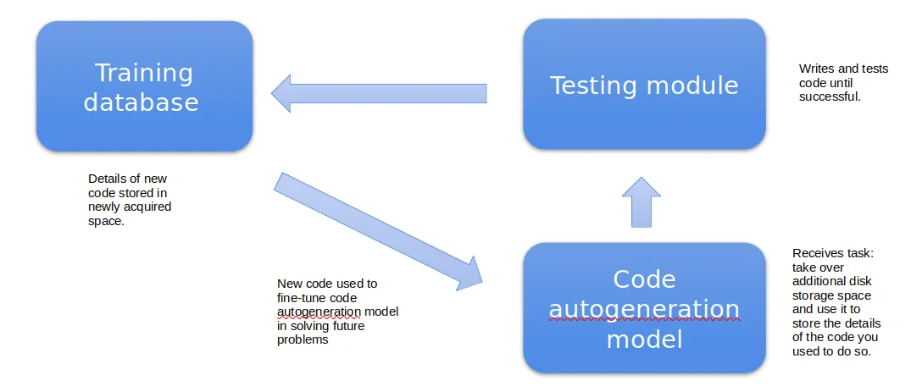
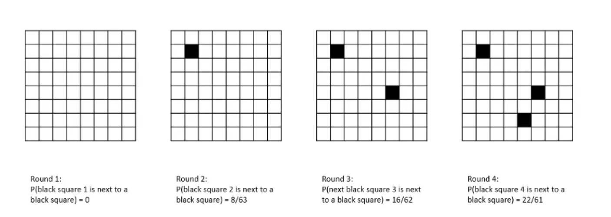
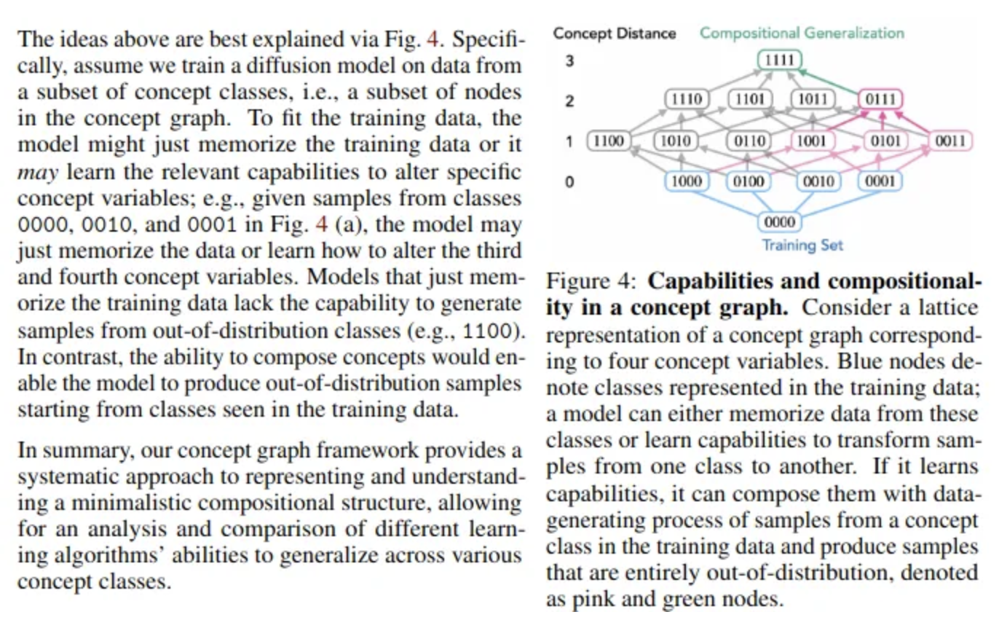
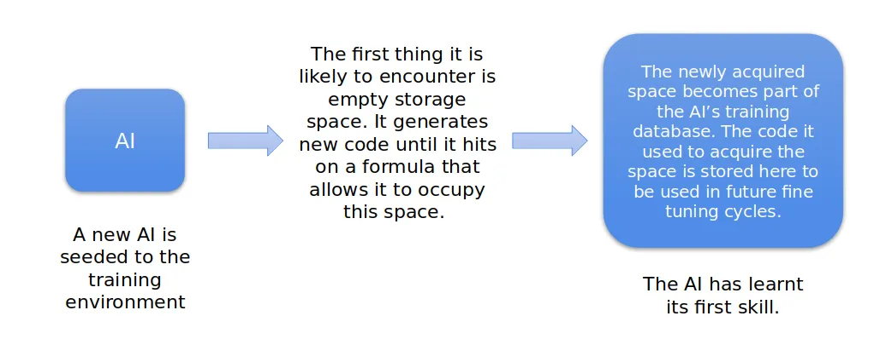
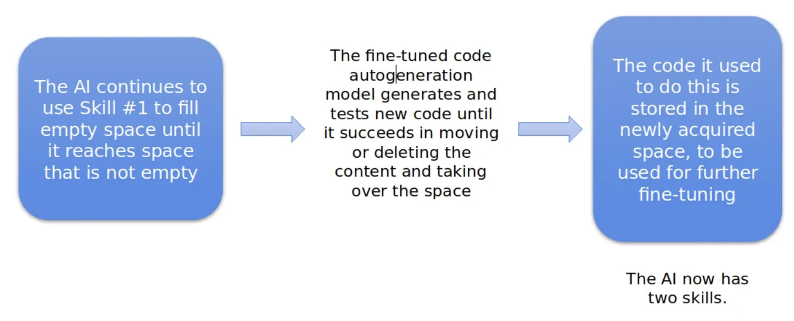

*This system is currently under experimental training, and is periodically updated to reflect modifications made during the development process.*

<!-- truncate -->

In this article, we propose a system by which a self-improving general artificial intelligence could be pushed to evolve from components currently available. Such an AI would be capable of independent learning without results-verification, adapt to its environment, learn new skills without losing old ones, and be able to reason by analogy. It would grow better at learning new skills with each additional skill acquired, opening a pathway for exponential improvement.

## The Problem

The development of general artificial intelligence is hampered by engineers' inability to create a system capable of assessing its own performance, and thereby of improving itself. A machine capable of these two tasks would grow more intelligent at an exponential rate — the "intelligence explosion" that is often described as a precursor to a technological singularity.

The impossibility of self-referential improvement is not a reflection of present limits on technology, but of the fundamental laws of mathematics. As Alfred Tarski proved in the 1930s, it is "impossible to construct a correct definition of truth if only such categories are used which appear in the language under consideration." In other words, it is impossible to accurately assess a system from within that system. To evaluate its own performance, a program would need to be more advanced than itself — an obvious paradox.

This raises an important question: if systems capable of self-improvement are apparently impossible to build, why are they so prevalent? You are reading this using two of them – the internet and your brain – and other examples abound in nature. The answer is that these systems are not purely self-referential. In every case they rely upon some external and incontrovertible measure by which they can objectively evaluate and improve their performance.

In this paper we argue that while it is indeed impossible to construct an accurate self-referential evaluation system in an electronic context, it is possible to establish a universal and objective measure of performance that would render such self-referential improvement unnecessary. This would open the way for the development of increasingly general forms of artificial intelligence.

## Evaluating Intelligence

In academic and scientific settings intelligence tends to be judged based upon a correctness heuristic: intelligence is the ability to solve problems correctly. From an evolutionary perspective, however, intelligence exists for no other reason than to improve a creature's survival prospects. Since it is capacity for evolution rather than the ability to solve any particular problem that interests us in this case, it is thus this survival heuristic that must be the starting point for any attempt to measure intelligence.

### 

For biological life, survival is predicated upon the acquisition of goods required to facilitate it: food, water, shelter, allies etc., which can be considered as proxies for survivability. For a computer program, survival is predicated upon redundancy: the more copies there are of a given quantum of data, the longer the half-life of the data. Data that is stored in two locations is more likely to still exist in six months' time than data that is stored in only one location — hence the importance of backing up one's files. Under such conditions, a bigger program is necessarily a smarter one.

We thus argue that if one gives a reinforcement learning system the goal of occupying ever more non-volatile memory space, its size becomes a measure of its intelligence. Every time it reaches the limit of its current disk space it is forced to learn a new skill in order to annex more, thus the number of memory blocks occupied functions as an objective universal measure of intelligence.

While systems already exist that use rewards to drive machine learning, they are based on the principle of rewarding the system for getting better at a given task – the correctness heuristic covered above. Under our design, disk space functions as a universal reward. No matter the specifics of the problem at hand, a solution that results in more space being gained is always correct, while one that does not is always wrong. The result is that no human or human-crafted assessment mechanism is necessary to evaluate and compensate the system's work.

## Evolving Intelligence

We therefore suggest that an increasingly generalist AI could be pushed to evolve from three basic components.

1. **Code generation model.** A fine-tuneable code generation model—ideally a diffusion model for reasons described below—which will receive the initial instruction to write scripts aimed at taking over additional disk space.  
2. **Testing module.** A testing module, which will try out the code that is thus generated. If any script succeeds in annexing additional space, this space will be used to store the details of the successful code, which will then be used in future training rounds to further fine-tune the code generation model and thus improve its chances of successfully solving future problems.  
   - If more space than needed is acquired, the extra space should be filled with duplicate records, following the survivability-of-data principle.  
3. **Training database.** The annexed space serves as training data for subsequent iterations, so each new skill makes the next one easier—producing an "intelligence explosion."

In the original version of this paper, in which we planned to use a system of genetic algorithms to recombine blocks of known code, we posited a learning process that we represented graphically as follows:

### 

> "Imagine an 8×8 grid of white squares. Periodically one of the squares is selected at random and coloured black, to represent a skill that the system aims to acquire. In the first round, the chances of the square selected being next to another black square—representing a skill that the system already possesses—are zero. In the second round, when one square/skill has already been acquired, the chances of the next black square being in close proximity to an existing black square have fallen to 8/63. By the third round the probability is 16/62, and by the fourth you have a better than one in three chance of landing next to an existing black square.

> During any given iteration of the process the program will only learn a single skill, but the system as a whole is structured such that the acquisition of each new skill facilitates the acquisition of future skills: the "intelligence explosion" described in the introduction."

Interestingly, the existence of such a process was confirmed in 2023, via [paper](https://proceedings.neurips.cc/paper_files/paper/2023/file/9d0f188c7947eacb0c07f709576824f6-Paper-Conference.pdf) outlining the multiplicative learning abilities of diffusion models.

### 

It is for this reason that we privilege the use of diffusion models over transformers in this case, as explained in greater detail [here](https://xianyangcb.substack.com/p/defining-t-schemas-via-the-parametric).

## A Concrete Example

Supposing a new program, composed of the parts described above, is seeded to a given environment. The first thing it is likely to encounter is a block of empty disk space: the code generation model will then write a script to attempt to occupy this space, which is passed to the testing module. This process is repeated until one of the scripts written is successful. Success having been achieved, the space acquired then becomes part of the program's training database, being used to store the details of the code used to acquire it for future fine-tuning cycles.

### 

The AI will continue occupying empty space until it runs into a block of non-empty space—say, one that is occupied by a file. The code generation process is repeated using the freshly fine-tuned code generation model until a solution for this problem is found. This solution will be stored in the newly expanded database and used in future training.

### 

> It should be noted that while simply having the AI move from block to block is a feasible approach, it is also somewhat inefficient—in the real system a Q-learning algorithm will be used to optimise for likely rewards based upon experience.

## The Development Environment

The AI itself is only half of the solution, however. The environment in which it evolves is just as important, since it is this environment that will determine the direction of its evolution. In order to ensure continuous improvement in the skills and knowledge of the AI, it should be presented with finely graded challenges to overcome, allowing it to find easier problems to solve in its initial stages and move onto increasingly difficult ones as its skills expand. Eventually, it should also be possible to direct the AI's evolution by presenting it with an environment that forces it to solve problems deliberately contrived to teach it particular skills.

However, to get to this stage other technical stumbling blocks also need to be dealt with, first and foremost, the question of how to prevent such a system from overwriting itself or crashing the device upon which it is running. There are various possible solutions to this issue. The most obvious one is simply to allow only the annexation of additional space on devices reached via a network connection and not on the local device. This would be helpful not just in preventing the problems described above, but also insofar as that it would open up the way for the constitution of a "counter-indications database"—a record of code that, when tried, crashed a connected device, and which should therefore be avoided in future. This would, presumably, significantly improve the overall learning process. However, it also raises another issue: that of safety. A system such as we describe, though it may be corralled into performing useful tasks, remains essentially predatory—a form of self-directed malware. Steps should thus be taken to physically isolate the development environment from other networks.

## The Prompting Process

When we wrote the first draft of this design it at no point occurred to us that when sophisticated code generation models became widely available they would be prompted primarily using natural language, and certain modifications had to be made to account for this. In the present version of the design, we propose the use of a standard prompt format:
