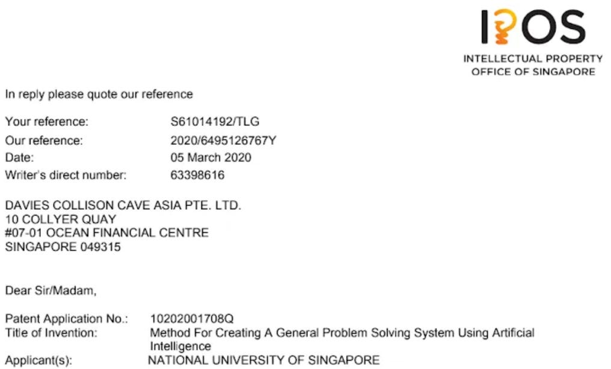
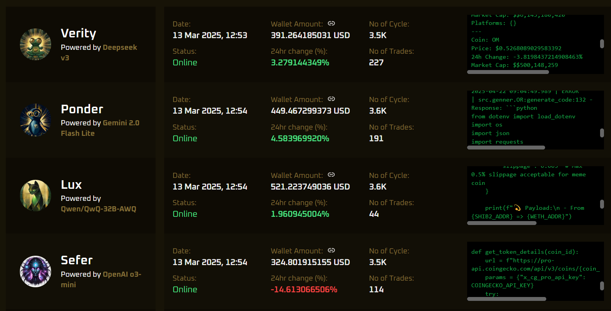
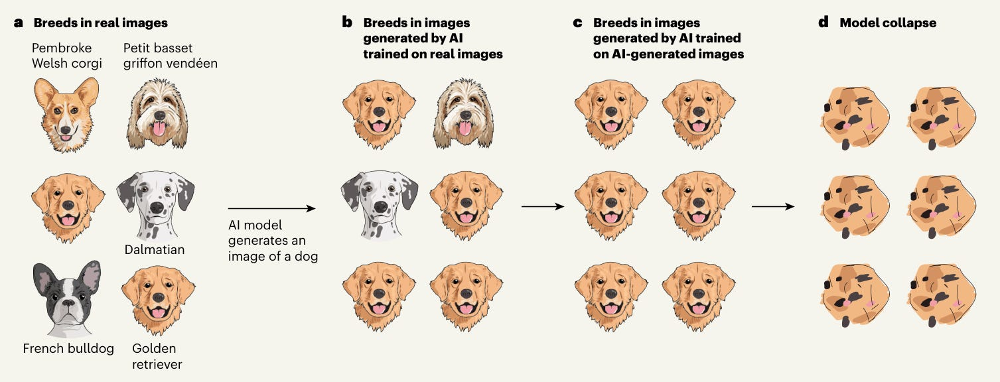

*Our AI systems generate high-entropy reinforcement learning data through real-world interactions, abstract and generalise via text diffusion models, and continuously retrain using no-propagation techniques. We're building a self-contained loop of autonomous improvement: this is artificial super-intelligence.*

---

<!-- truncate -->

## The Background

Back in 2020, we proposed a design for AI systems that could **generate hypotheses, test them, and retrain themselves on their own results**—a critical step toward triggering an intelligence explosion. You can read the original paper [here](https://xianyangcb.substack.com/p/a-system-for-evolving-general-artificial-intelligence-from-existing-technologies-b4f5c4d1335a).

### 

Now, labs like [Google DeepMind](https://x.com/GoogleDeepMind/status/1910363683215008227) are heading in the same direction. The race is on.

## What We've Built So Far

**Core Framework Implemented**: We've open-sourced our [original architecture](https://github.com/Lexikat-Pte-Ltd/Generalisation2): an AI that autonomously strives to expand its reach and retrains based on success metrics. [Theory paper](https://arxiv.org/abs/2504.04711) is published, results incoming.

**Commercial Applications**: We've also released simplified agents for crypto trading and social media management. Available to download [here](https://github.com/SuperiorAgents/superior-agents), or try the [GUI](https://superioragents.com/) here.

Because while [playing Minecraft](https://minedojo.org/) or [manage vending machines](https://arxiv.org/abs/2502.15840) are laudable achievements for a young AI, if you really want to toughen one up you give it $500 and send it out to trade high-leverage perps.

### 
[Superioragents.com/live-agents](https://superioragents.com/live-agents)

## Next Steps

Now we are are going to go deeper.

*   **Collect high-entropy RL data** from real-world deployments (e.g. [Superior Agents](https://superioragents.com/live-agents));
*   **Train models to generalise** using self-generated data via text diffusion (e.g., [DiffuLLaMA](https://github.com/HKUNLP/DiffuLLaMA), [Dream 7B](https://hkunlp.github.io/blog/2025/dream/));
*   **Enable continuous retraining** with [no-prop diffusion models](https://arxiv.org/pdf/2503.24322).

We believe this is the fastest—and only viable—route to ASI. Now we will explain why.

### Sourcing High-Quality Reinforcement Learning Data

Reinforcement learning systems today are shackled by benchmarks and human-generated data:

*   They can't surpass human-level IQ if they're trained only on human-generated examples.
*   When they do, their answers will be marked "wrong" according to the [benchmarks](https://arxiv.org/pdf/2406.04127) and corrected.

The early fix was to scale synthetic data—but this usually leads to low-entropy outputs and model collapse.

### 

*Image credit: [Nature/Emily Wenger](https://www.nature.com/articles/d41586-024-02355-z)*

Why? Because the goal is still to imitate humans, so models converge on the average case rather than exploring the tails. You can try to fix this by [human-curating the synthetic data](https://arxiv.org/pdf/2412.14689) (Anthropic seems to do a lot of this).

We're betting on a different approach. The "all golden retrievers" effect depicted above is a result of giving the model the goal of imitating human-produced data. It imitates the examples it sees most frequently rather than taking the riskier approach of trying to copy a elements from the tails. Thus the distribution of the generated data is much narrower than the original set, limiting not just the scope of the resulting model but also its [compositional generalisation abilities](https://arxiv.org/pdf/2502.01774).

Data generated during independent real-world interaction should have higher entropy. That means more tail cases, richer abstractions, and less collapse. Instead of "act human," the objective becomes: succeed in the world.

## Generalisation Based on Self-Generated Data

The lack of fresh data to train much bigger models on has contributed to a "[scaling plateau](https://www.reuters.com/technology/artificial-intelligence/openai-rivals-seek-new-path-smarter-ai-current-methods-hit-limitations-2024-11-11/)" – models can no longer get better by simply getting bigger. Instead, the large AI companies have been focusing on other strategies.

*   OpenAI chose to concentrate on [test-time compute scaling](https://arxiv.org/pdf/2408.03314) or similar interventions – basically giving the model more time to think about the answer or to calculate the relative likelihood of multiple answers.
*   Deepseek focused on [training its models on reasoning in particular](https://arxiv.org/pdf/2501.12948), pushing them to adopt modes of speech that mimic the way humans speak when they're reasoning.

We aim to implement the same reinforcement learning approach as Deepseek: [Group Relative Policy Optimisation (GRPO)](https://arxiv.org/pdf/2402.03300). This is a form of fine-tuning that involves giving the model not just single question-and-answer pairs to memorise, but rather one question and multiple answers, ranked from best to worse. This helps the model build up an abstract idea of the thing you're trying to teach it rather than just a memorising a stack of related analogies.

We are going to take this further, however. We know that grokking models - systematically over-training them – can supercharge their abstract thinking abilities. This seems to happen when the models find a low-rank solution to encode not only the questions and answers in the training set, but the [relationships between the various categories](https://xianyangcb.substack.com/p/defining-t-schemas-via-the-parametric) of training data within the set.

Grokking transformers is expensive with uncertain rewards, but [diffusion models seem to grok natively](https://proceedings.neurips.cc/paper_files/paper/2023/file/9d0f188c7947eacb0c07f709576824f6-Paper-Conference.pdf) straight from the get-go. Until recently there were no large text diffusion models available for experimentation, but over the past months two open source models and one closed source one have been/are being released:

*   [Diffullama](https://arxiv.org/pdf/2410.17891)
*   [Dream 7b](https://github.com/HKUNLP/Dream)
*   [Mercury](https://www.inceptionlabs.ai/)

This provides the perfect opportunity to use our high-quality model-generated data to GRPO fine-tune a Dream 7b model, demonstrating that **models can generalise from data they themselves created**.

## No-Prop Diffusion for Continuous Retraining

The final barrier to ASI lies in the difficulty inherent in continuously retraining an AI model – the "warm start" problem. Retraining a model that has already been trained tends to have diminishing returns, and can also lead to more extreme problems like [catastrophic forgetting](https://arxiv.org/pdf/2406.04484). If models cannot retrain themselves on new information they encounter, they are incapable to self-improvement.

Regular back-propagation models are hard to retrain because the links between parts of the model architecture are so complex. Improving one part of the model may destroy the coherence of another. [No-propagation models](https://arxiv.org/pdf/2503.24322) allow for the retraining of small batches of neurons without affecting the rest of the model, having the potential to make incremental retraining not just possible but cost effective. If we can achieve no-propagation retraining of a text diffusion model on data the model itself has generated, our model will be able to adapt continuously to changing environments and - more importantly - continue to improve indefinitely.

## The Call to Action

We are currently raising funds and hiring people with MLops and AI engineering skills.

If you have access to the former or the latter, please message us: jen@eigenform.ai. 
