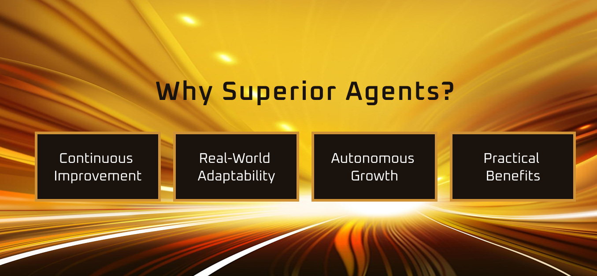

# Understanding Superior Agents

## What is Superior Agents?

Superior Agents is an innovative framework designed to empower AI to continuously improve itself through autonomous evolution. It integrates self-improving mechanisms with dynamic environments and real-time performance metrics to create agents that learn, adapt, and excel over time. Whether it's through fine-tuned code generation, robust testing, or advanced retraining loops, Superior Agents enable a new era of intelligent systems that evolve based on practical, survival-driven incentives.

## Why Superior Agents?

Unlike traditional AI that sticks to preset rules and limited learning cycles, Superior Agents take a more flexible, real-world approach:

- **Continuous Improvement:**  
  Every problem an agent solves adds to its knowledge base, enabling it better at tackling future challenges. Continiously learning from mistakes and using that experience to handle more complex tasks down the road.

- **Real-World Adaptability:**  
  Superior Agents are designed to work in various real-life scenarios. They use feedback—like social media engagement or financial performance—to tweak and improve their strategies in real time.

- **Autonomous Growth:**  
  Agents aren’t just following a script; they’re constantly discovering new ways to improve on their own. As they face new challenges, they adjust their methods and learn, pushing the boundaries of what they can do.

- **Practical Benefits:**  
  Built for real-world applications, Superior Agents can manage social media, handle trading strategies, and more. Their design focuses on measurable success, improvements directly translate to better performance in everyday tasks.

In summary, Superior Agents transform the traditional AI paradigm by shifting the focus from static problem-solving to dynamic, survival-driven evolution. This approach not only opens up new possibilities for autonomous intelligence but also bridges the gap between theoretical AI and real-world, adaptive systems.
