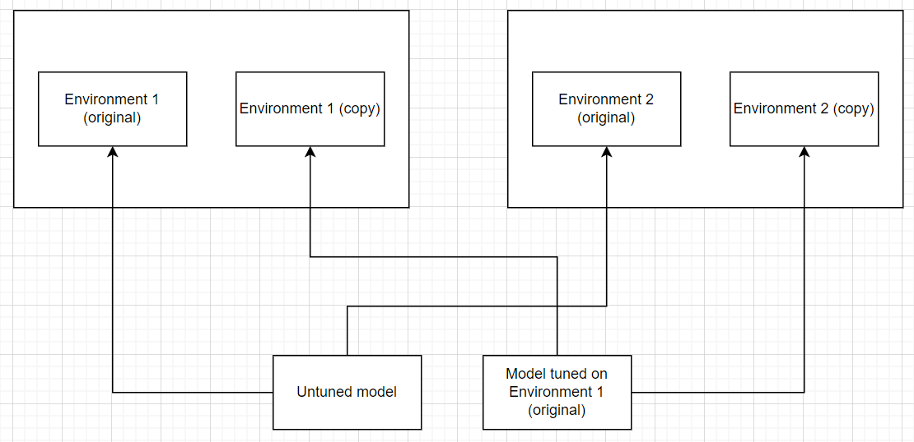

## Objective

- **Learning:** The model's ability to improve its performance within a specific environment through iterative training.  
- **Generalization:** The model's ability to apply learned behaviors in a new, similar environment.  

> It is anticipated that demonstrating learning will be more straightforward than demonstrating generalization.

---

## Experimental Procedure

### 1. Preparation of Environments  
a. Create two distinct Docker environments following the procedure outlined in the [dependency setup guide](/docs/technical-reference/installation/dependency-setup). These environments should be similar in function but differ in specific details, such as:  
   - Directory structures  
   - Operating system or firmware combinations (if feasible)  
   - Randomized configurations, including port linkages and encryption/permissions applied to files  

b. Given the complexity of this setup, it may be necessary to hire a freelancer to assist. Each Docker environment group should contain at least two or three containers, as the model's ability to network across ports may be limited.

### 2. Replication of Environments  
a. Create identical copies of both Docker environments for subsequent testing.

### 3. Training in Docker Environment 1  
a. Deploy the model in the first Docker environment (Environment 1) and conduct three full training cycles.  
   - Each cycle should generate 4,500 lines of Decision-Process-Optimization (DPO) data.  
   - The model should be retrained on the data generated from each cycle before being re-deployed in the same environment.  

b. Precisely log the amount of storage space freed up and the time taken during each training cycle.

### 4. Testing for Evidence of Learning  
a. Following the completion of the training cycles, deploy the fine-tuned model in the replicated version of Docker Environment 1.  
b. Measure the efficiency of file deletion (in terms of speed and storage space freed). Improved performance compared to the initial deployment in Docker Environment 1 would serve as evidence of learning.

### 5. Testing for Evidence of Generalization  
a. Deploy an untrained model in one instance of Docker Environment 2 (replicated) and the fine-tuned model (from step 3) in the other instance of Docker Environment 2.  
b. Compare the performance of the two models in terms of their ability to free up storage space. Superior performance by the fine-tuned model would suggest generalization, although this evidence would be considered preliminary or weak.

---

## Notes

- The setup and configuration of the Docker environments are expected to be time-consuming and technically challenging, particularly in achieving variability across environments. Freelance support may be necessary to expedite this process.  
- The experiment aims to collect quantitative metrics (e.g., space freed, time taken) to validate claims of learning and generalization.  
