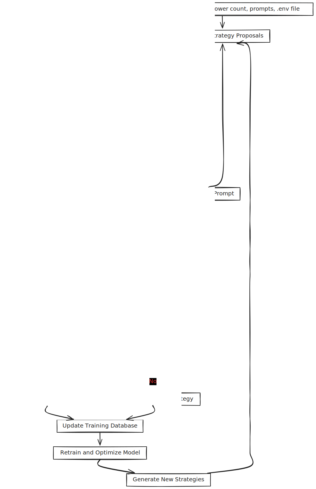
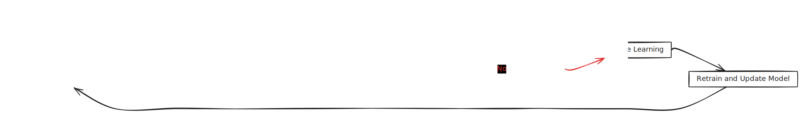

# Case Study: Marketing on X.com

Our framework enables any open source model to start with a simple goal and gradually acquire a wide range of skills. By leveraging instrumental convergence, the AI learns to develop increasingly diverse and effective strategies.

This case study illustrates how the framework can be applied to enhance a marketing agent working on X.com. The process is designed to gradually expand the agent’s capabilities through continuous evolution.

## How It Works

### 1. Initial Information
The agent is provided with four key pieces of information:
- **Follower Count:** The number of followers the account had at midnight on the day in question.
- **Strategy Prompt:** An instruction to develop a set of strategies for increasing followers.
- **Code Prompt:** A command to write code that implements the chosen strategy.
- **.env File:** Credentials such as private keys for the X.com account and any other necessary API keys (e.g., for cryptocurrency wallets or payment processors).

### 2. Strategy Generation
Next, the agent is given the current follower count at the start of the day along with the status of its .env file. With this data, it generates a list of potential strategies to improve the follower count.

### 3. Implementation
One strategy is selected, and the agent writes code to implement it.  
*Note: The diagram omits some error handling loops and debugging instructions, which are detailed in our GitHub repository.*

### 4. Evaluation and Data Collection
At the end of the day, the agent's performance is evaluated:
- **Metrics Check:** The follower count is remeasured.
- **Response Handling:**  
  - If the strategy is successful, the strategy and its code are recorded in the DPO folder as the "chosen" response, while a garbled version is stored as the "rejected" response.
  - Alternatively, they may be added to a GRPO file, where responses are grouped and ranked based on follower growth.
- **Data Vectorization:** The outcomes are vectorized and stored in a RAG database for future training.

### 5. Retraining
Once enough data is collected, the agent is retrained. Successful strategies are reinforced, while less effective ones are discarded. Over time, this iterative process helps the agent develop an "intelligence explosion" by improving its ability to increase follower engagement.

A slightly expanded version of this approach can also encourage the agent to optimize other aspects of social media, such as content strategy and community engagement.

**Important Note:**  
While it would be ideal for the agent's evolution to occur naturally over time, practical constraints often require us to nudge it towards specific skills—either by providing tailored stimuli or by pre-training on certain tasks.